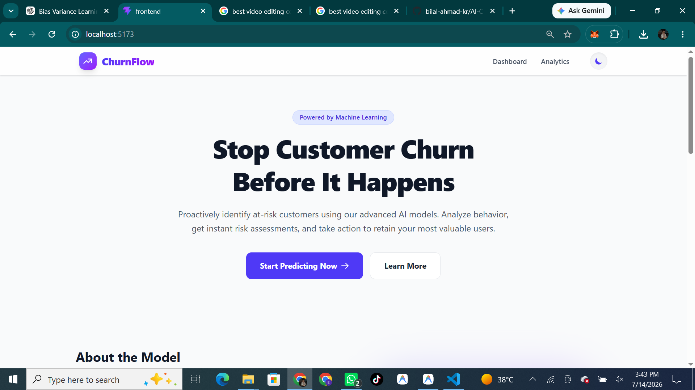
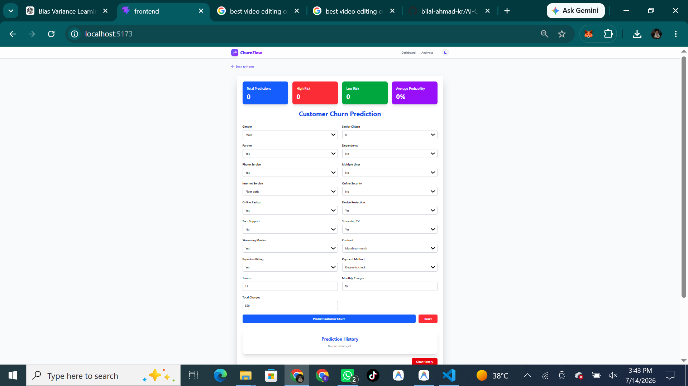
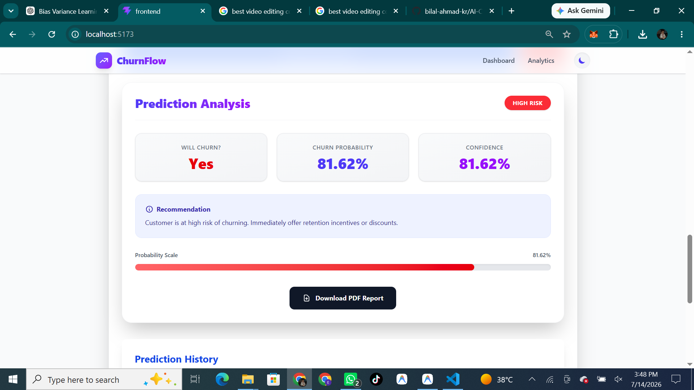
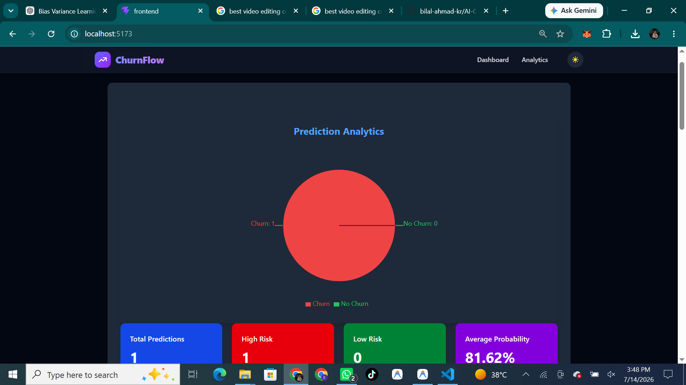

# 🚀 ChurnFlow: AI Customer Churn Prediction Platform


> *Note: Replace the placeholder image above with an actual screenshot of your Landing Page.*

**ChurnFlow** is a modern, portfolio-quality web application powered by Machine Learning that predicts whether a customer is at risk of churning. It leverages a robust Logistic Regression model trained on telecommunications data, coupled with a blazingly fast FastAPI backend and a stunning, responsive React frontend.

---

## ✨ Features

- **🧠 Advanced Machine Learning Model:** Built with Scikit-Learn utilizing StandardScaler and One-Hot Encoding for precise 79% accuracy.
- **⚡ Real-Time Predictions:** Lightning-fast FastAPI backend serves predictions in milliseconds.
- **📊 Deep Analytics & Insights:** Receive comprehensive prediction analysis including probability scaling, confidence percentages, and dynamic risk levels.
- **💡 Actionable Recommendations:** Gets tailored business advice on how to retain at-risk users directly in the UI.
- **📱 Beautiful, Responsive UI:** A premium React frontend utilizing Tailwind CSS, featuring glassmorphism, dark mode, and sleek micro-animations.
- **📄 PDF Report Generation:** Instantly download prediction reports for business stakeholders.

---

## 📸 Screenshots

| Landing Page | Prediction Form |
|--------------|-----------------|
|  | |

| Result Analysis | Dark Mode UI |
|-----------------|--------------|
|  |  |

*(Note: Replace these placeholders with your actual screenshots)*

---

## 🔗 Demo Link

- **Live Frontend Demo:** [Insert Vercel/Netlify/Render Link Here]
- **API Endpoint:** [Insert Backend Deployment Link Here]

---

## 📂 Folder Structure

```text
AI Customer Churn Prediction Platform/
├── app/
│   ├── main.py              # FastAPI server and prediction logic
│   ├── schema.py            # Pydantic models for data validation
│   └── __init__.py
├── models/
│   ├── Customer_churn_model.pkl   # Trained Scikit-Learn Pipeline
│   └── feature_columns.pkl        # Encoded feature mapping
├── frontend/
│   ├── public/              # Static assets
│   ├── src/
│   │   ├── components/      # React components (Navbar, LandingPage, ResultCard, etc.)
│   │   ├── utils/           # Helper functions (e.g., downloadReport.js)
│   │   ├── App.jsx          # Main React Application
│   │   └── main.jsx         # React Entry Point
│   ├── package.json         # Frontend dependencies
│   ├── tailwind.config.js   # Tailwind CSS configuration
│   └── vite.config.js       # Vite configuration
├── requirements.txt         # Python backend dependencies
└── README.md                # Project documentation
```

---

## 🛠️ Installation & Setup

### Prerequisites
- Node.js (v16 or higher)
- Python (v3.9 or higher)

### 1. Clone the Repository
```bash
git clone https://github.com/your-username/churnflow.git
cd churnflow
```

### 2. Backend Setup (FastAPI & ML)
```bash
# Create and activate a virtual environment
python -m venv .venv

# On Windows:
.venv\Scripts\activate
# On Mac/Linux:
source .venv/bin/activate  

# Install dependencies
pip install -r requirements.txt

# Run the FastAPI server
python -m uvicorn app.main:app --port 8000 --host 0.0.0.0 --reload
```
*The backend will be running at `http://localhost:8000`*

### 3. Frontend Setup (React & Vite)
```bash
# Navigate to the frontend directory
cd frontend

# Install dependencies
npm install

# Start the development server
npm run dev
```
*The frontend will be running at `http://localhost:5173`*

---

## 📡 API Documentation

The backend provides a RESTful API powered by FastAPI. When running locally, you can view the interactive Swagger documentation at `http://localhost:8000/docs`.

### Predict Churn
- **Endpoint:** `/predict`
- **Method:** `POST`
- **Content-Type:** `application/json`

**Request Body Example:**
```json
{
  "gender": "Male",
  "SeniorCitizen": 0,
  "Partner": "Yes",
  "Dependents": "No",
  "tenure": 12,
  "PhoneService": "Yes",
  "MultipleLines": "No",
  "InternetService": "Fiber optic",
  "OnlineSecurity": "No",
  "OnlineBackup": "Yes",
  "DeviceProtection": "Yes",
  "TechSupport": "No",
  "StreamingTV": "Yes",
  "StreamingMovies": "Yes",
  "Contract": "Month-to-month",
  "PaperlessBilling": "Yes",
  "PaymentMethod": "Electronic check",
  "MonthlyCharges": 70.0,
  "TotalCharges": 850.0
}
```

**Response Example:**
```json
{
  "prediction": "Yes",
  "churn_probability": 0.8162,
  "risk_level": "High",
  "confidence": "81.62%",
  "recommendation": "Customer is at high risk of churning. Immediately offer retention incentives or discounts."
}
```

---

## 🚀 Future Improvements

- **Database Integration:** Connect to PostgreSQL or MongoDB to store prediction history and user feedback.
- **Batch Predictions:** Allow uploading of CSV files for bulk customer churn predictions.
- **Authentication:** Implement JWT-based user authentication for secure API access and personalized dashboards.
- **Model Retraining:** Create a pipeline that allows the model to periodically retrain on newly collected data.
- **Advanced Visualizations:** Integrate Chart.js or Recharts in the frontend to show feature importance (SHAP values) for each prediction.

---

*Made with ❤️ for AI Engineering & Modern Web Development.*
